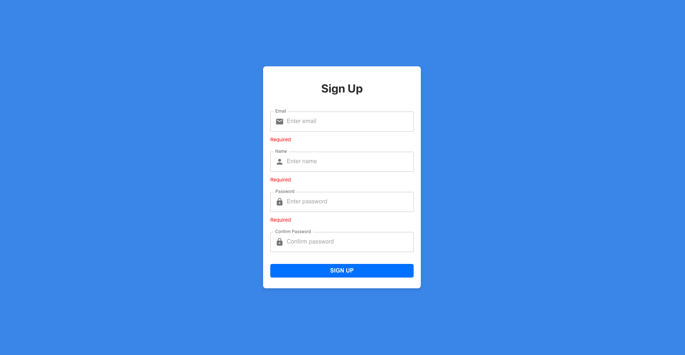
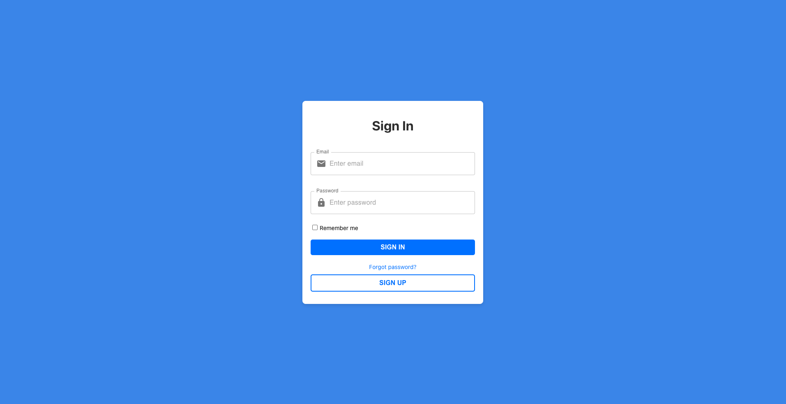
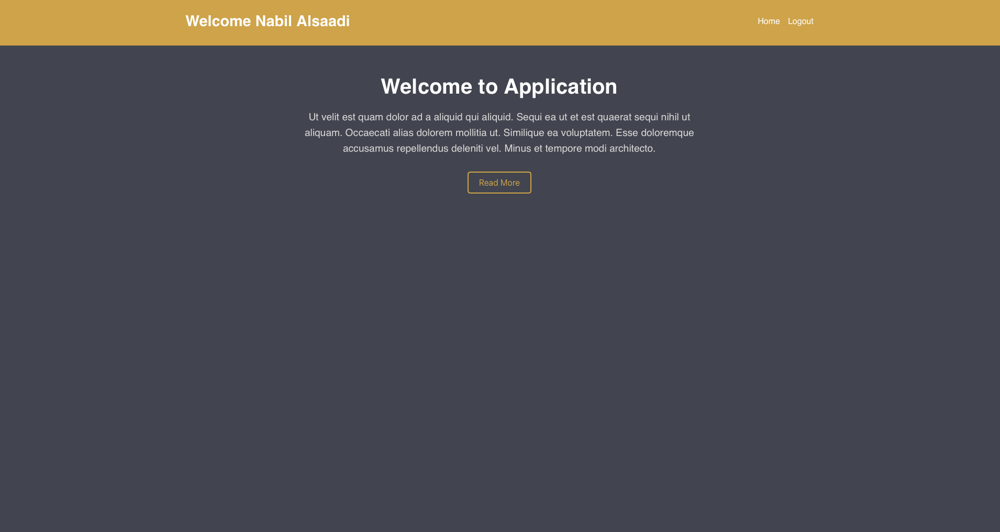

# User Authentication Module

This project is a user authentication module built with a modern tech stack including **React** for the frontend, **NestJS** for the backend, **MongoDB** for data storage, and **Redux** with **Redux Observable** for state management. The module provides a secure sign-up and sign-in mechanism, complete with JWT authentication and form validation.


## Overview

The User Authentication Module is designed to provide a seamless authentication experience for users. It allows users to sign up and sign in using secure practices and JWT for token-based authentication. The module uses Formik for form handling, Yup for validation, and Redux for managing application state.

## Screenshots
### Sign-Up, Sign-In, and Home
<div style="display: flex; justify-content: space-between; align-items: center;">
  
  
  
</div>

## Features

- **User Registration**: Secure sign-up with validation and password hashing.
- **User Login**: Authenticate users with email and password.
- **JWT Authentication**: Protect routes using JWT tokens.
- **Form Validation**: Client-side validation using Yup and Formik.
- **Redux State Management**: Centralized state management with Redux and Redux Observable.
- **State Persistence**: Persist Redux state across sessions using Redux Persist.
- **Asynchronous Handling**: Use RxJS to manage complex asynchronous actions.
- **Error Handling**: Graceful error handling and feedback to users.


## Technologies Used

### Frontend

- **React**: A JavaScript library for building user interfaces.
- **Redux**: A predictable state container for JavaScript apps.
- **Redux Observable**: Middleware for Redux to handle async actions.
- **Redux Persist**: Persist and rehydrate a Redux store.
- **Formik**: A library for building forms in React.
- **Yup**: JavaScript schema builder for value parsing and validation.
- **Material-UI**: React components for faster and easier web development.
- **Axios**: Promise-based HTTP client for the browser and Node.js.
- **RxJS**: A library for reactive programming using observables.

### Backend

- **NestJS**: A progressive Node.js framework for building efficient and scalable server-side applications.
- **MongoDB**: A NoSQL database for storing user data.
- **Mongoose**: An ODM for MongoDB to manage relationships between data.
- **JWT (JsonWebToken)**: For token-based authentication.
- **bcrypt**: A library to hash passwords securely.
- **winston**: A library to handle server logging.


## Project Setup

### Prerequisites

- **Node.js**: Ensure you have Node.js installed on your system.
- **npm or Yarn**: A package manager to install dependencies.

### Installation

1. **Clone the Repository**
  ```sh
  git clone https://github.com/nabil-alsaadi/auth-app.git
  ```
2. **Go to auth-app-backend and install NPM packages**
```sh
  cd auth-app/auth-app-backend
  npm install
  ``` 
4. **Run the Development Server**
```sh
   npm run start
   ```
6. **In other terminal go to auth-app-frontend and install NPM packages**
```sh
  cd auth-app/auth-app-frontend
  npm install
  ```
7. **Start the frontend**
```sh
   npm run start
   ```


   
## API Documentation

The backend API provides the following endpoints:

- POST /auth/register: Register a new user.
- POST /auth/login: Authenticate a user and return a JWT token.
- GET /users/profile: Retrieve user profile information (protected route).
- GET / : Retrieve hello world (protected route).

  
For more detailed API documentation, refer to the API docs included in the backend directory.

## Logging

The application uses Winston for logging, providing robust logging capabilities with different levels and transports for debugging and monitoring.

- Console: Log output to the console for easy development debugging.
- File: Log error and combined logs to files for persistence.
